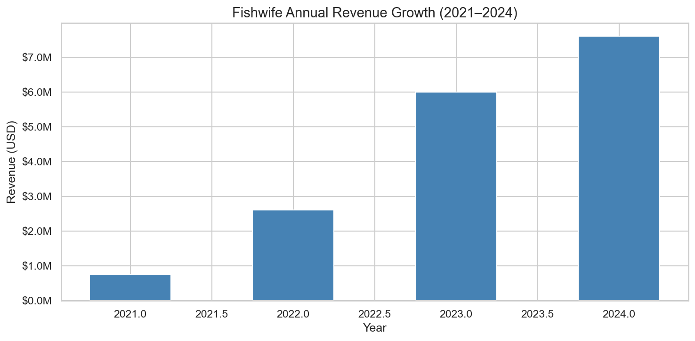
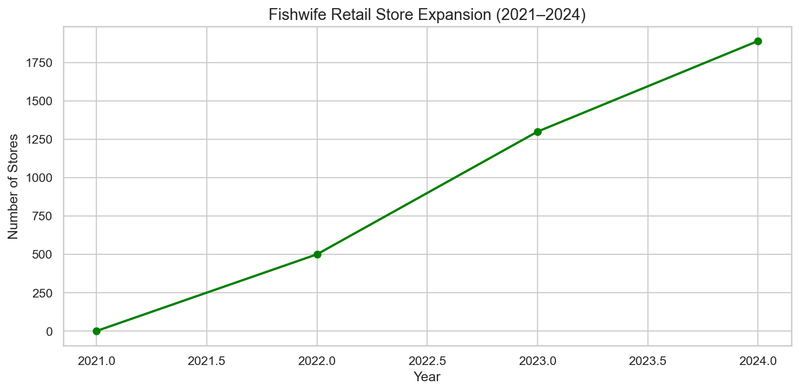
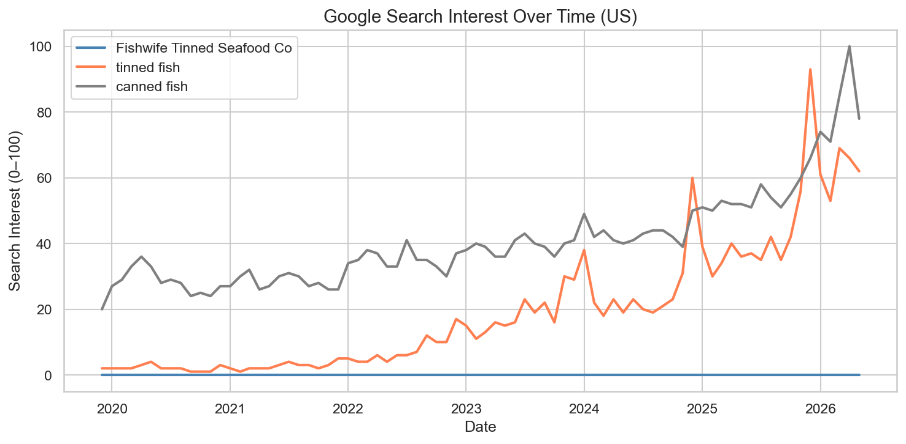
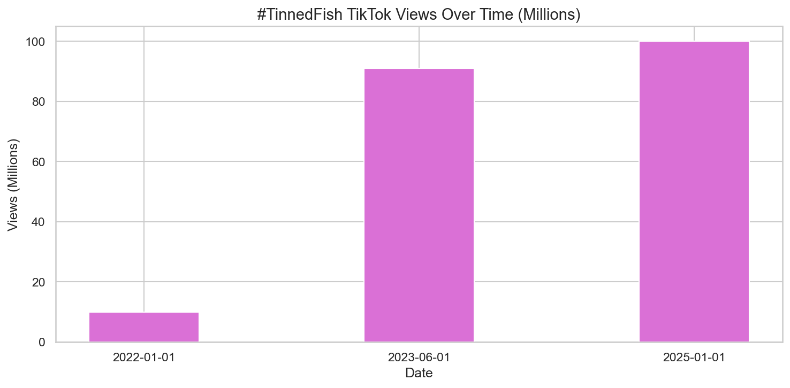
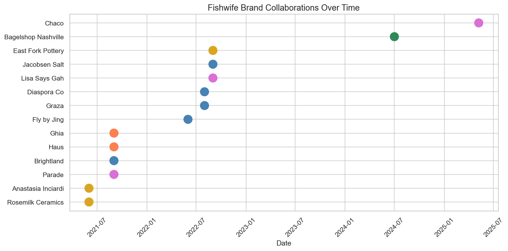
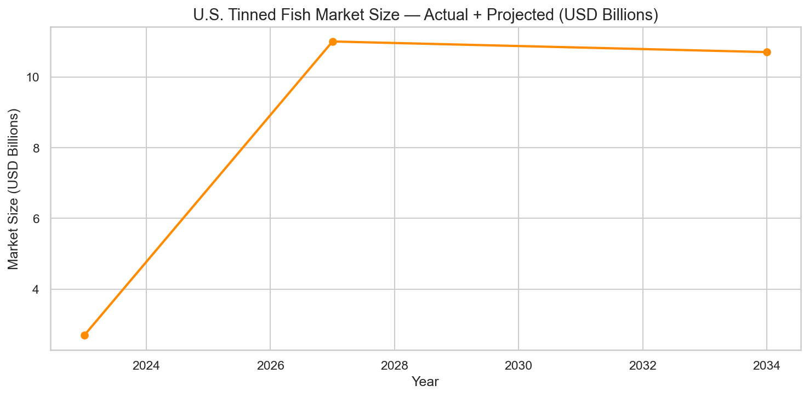
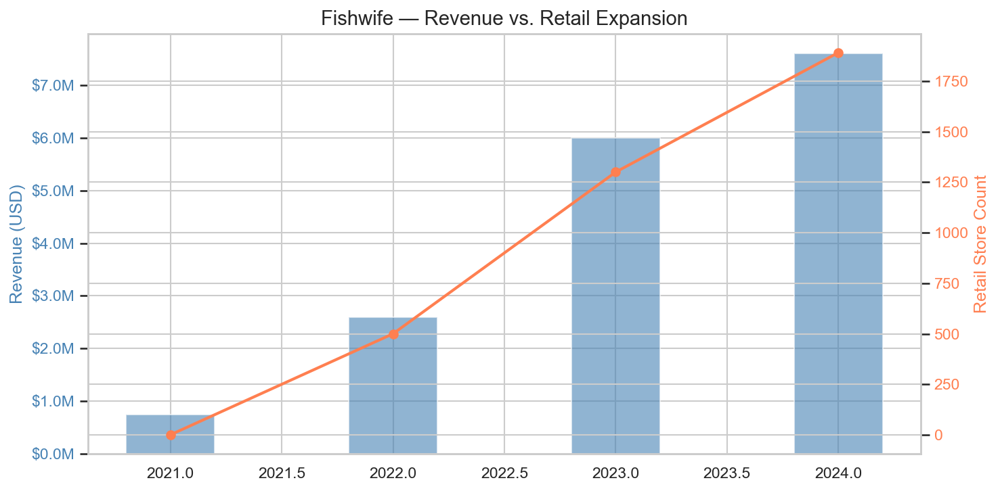

# Fishwife Tinned Seafood Co. - Brand & Growth Analysis

## Overview
Fishwife didn't just sell fish, it sold an aesthetic, a lifestyle, and a modern 
identity around tinned seafood. This project analyzes how a female-founded DTC 
startup grew from $750K to $7.6M in revenue in 4 years through organic social 
media, strategic brand collaborations, and premium positioning in a commodity category.

## Thesis
Fishwife's growth was driven not by the product itself, but by a deliberate 
identity-first branding strategy that reframed "canned fish" as "tinned fish" 
and turned a pantry staple into a cultural moment.

## Data Sources
| Dataset | Description | Source |
|---|---|---|
| Revenue | Annual revenue 2021–2024 | Shark Tank pitch + Shark Tank Talks |
| Retail Expansion | Store count and key retailers by year | Press releases, Shark Tank recap |
| Google Trends | Search interest for "Fishwife", "tinned fish", "canned fish" | Google Trends (US, 2020–present) |
| TikTok Views | #tinnedfish and #fishwife hashtag views over time | News articles, manual tracking |
| Collaborations | Brand partnership timeline with partner type | Press releases, news articles |
| Market Size | U.S. tinned fish market size actual + projected | Industry reports |
| Funding Rounds | Investment history including Shark Tank | Crunchbase, CB Insights |

## Key Findings
- Revenue grew 10x in 4 years, driven almost entirely by organic social media until 2023
- Google search interest for "tinned fish" rose sharply alongside Fishwife's growth 
  while "canned fish" stayed flat, evidence of a category rebrand
- Collaborations evolved from art/lifestyle partners (2021) → food brand collabs (2022) 
  → fashion crossovers (2025), reflecting a deliberate shift from food brand to 
  lifestyle brand
- Retail expanded from 0 to 1,891 stores, directly mirroring social-driven brand awareness
- #tinnedfish reached 91M+ TikTok views, a cultural moment Fishwife both rode and created

## Visualizations

### Revenue Growth

### Retail Expansion

### Google Search Interest

### TikTok Hashtag Views

### Brand Collaboration Timeline

### U.S. Market Size

### Revenue vs. Retail Expansion

## Tools Used
Python · Pandas · Matplotlib · Seaborn · Jupyter Notebook

## Author
Sadie Greenberg | [LinkedIn](https://www.linkedin.com/in/sgbrg) | 
[Email](mailto:sadieagberg@gmail.com)
